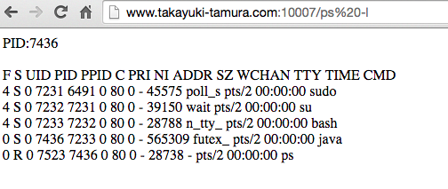

# shell-exec-java-server

## Description
Using this srever, you can access remote server and execute shell commands
For example)
You would lost ssh key,  But don't wory.
Keeping this server working means you hava back door.

## Usage

<strong>First Step</strong>

Change the port for running this program.
```public static final int PORT = 10007;```
The default port is 10007.


<strong>Second Step</strong>

Execute this program.
```java -cp . shell.exec.java.server.ShellExecServer```
If you want to keep running after logout, Use this script
```nohup java -cp . shell.exec.java.server.ShellExecServer  > out.log 2> err.log &```


<strong>Third Step</strong>

Access using web browser.
For example) 
Execute ```ps -l```
```http://www.takayuki-tamura.com:10007/ps l```



<strong>Third Step</strong>

To stop this program, you have to kill the process.
The process id id written the top of your browser.Like ```PID:7436```


## Licence
[MIT](https://github.com/tcnksm/tool/blob/master/LICENCE)

## Author
[takayuki-tamura](https://github.com/takayuki-tamura)
